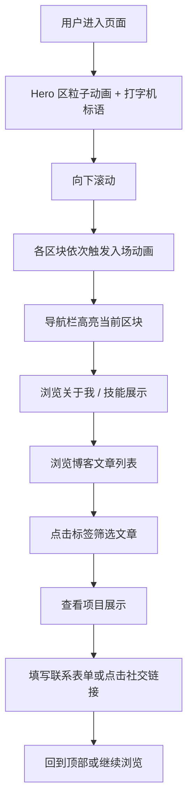

## 1. 产品概述

一个赛博朋克/科技未来主义风格的个人博客单页面，展示个人信息、技术能力、博客文章和联系方式。目标用户是科技行业从业者、潜在雇主、技术社区伙伴。旨在通过极具视觉冲击力的科技风设计，打造令人印象深刻的个人品牌形象。

## 2. 核心功能

### 2.1 功能模块

1. **导航栏**: 固定顶部导航，包含 Logo 和各区块锚点链接，带有滚动高亮和毛玻璃效果
2. **Hero 英雄区**: 全屏开场区域，粒子背景动画，打字机效果展示个人 Slogan，霓虹发光标题
3. **关于我**: 个人简介，头像展示（带发光边框），技术栈标签云动画
4. **技能图谱**: 雷达图/进度条展示核心技能熟练度，使用 CSS 动画实现
5. **博客文章**: 卡片式文章列表，带悬浮 3D 翻转效果，标签分类筛选
6. **时间线**: 工作/学习经历的可视化时间轴，带滚动触发动画
7. **项目展示**: 精选项目的展示区，带图片预览和详情弹窗
8. **联系方式**: 社交链接图标，联系表单（带终端风格输入框）
9. **页脚**: 版权信息，回到顶部按钮

### 2.2 页面详情

| 页面名称 | 模块名称 | 功能描述 |
|---------|---------|---------|
| 首页（单页） | 导航栏 | 固定顶部，毛玻璃背景，滚动时高亮当前区块，移动端折叠菜单 |
| 首页（单页） | Hero 区 | 全屏 Canvas 粒子背景，逐字打出的个人标语，霓虹灯效果的标题文字，向下滚动指示器 |
| 首页（单页） | 关于我 | 左右布局，左侧头像带发光旋转边框，右侧简介文字，下方技术标签云 |
| 首页（单页） | 技能图谱 | 六边形蜂巢布局或圆形进度环展示技能，CSS 动画填充效果 |
| 首页（单页） | 博客文章 | 3 列卡片网格，悬浮时卡片 3D 翻转展示摘要，标签可点击筛选 |
| 首页（单页） | 时间线 | 垂直时间轴，左右交替布局，每项带图标和渐变连线，滚动入视动画 |
| 首页（单页） | 项目展示 | 横向滚动或网格展示项目卡片，带遮罩悬浮效果，点击弹出详情 |
| 首页（单页） | 联系方式 | 终端风格输入框，带光标闪烁效果，社交图标带悬浮脉冲动画 |
| 首页（单页） | 页脚 | 深色背景，渐变分割线，社交链接，回到顶部按钮 |

## 3. 核心流程

## 4. 用户界面设计

### 4.1 设计风格

- **主色调**: 深空黑底 `#0a0a0f`，辅以暗蓝 `#0d1117`
- **强调色**: 电光青 `#00f0ff`（主强调）、霓虹紫 `#b400ff`（次强调）、矩阵绿 `#00ff41`（终端元素）
- **按钮风格**: 边框发光按钮，悬浮时填充霓虹渐变，带外发光 box-shadow
- **字体**: 标题使用 `Orbitron`（科技感几何字体），正文使用 `JetBrains Mono`（等宽代码字体），搭配 `Noto Sans SC` 中文
- **布局风格**: 全宽区块交替，大量使用负空间和不对称布局，部分元素突破网格
- **图标风格**: 简约线条图标，带霓虹发光效果

### 4.2 页面设计概览

| 页面名称 | 模块名称 | UI 元素 |
|---------|---------|--------|
| 首页 | 导航栏 | 毛玻璃半透明背景，Logo 使用霓虹文字发光，导航链接带底部滑动指示条 |
| 首页 | Hero 区 | 全屏高度，Canvas 动态粒子连线背景，大标题使用 text-shadow 多层发光，副标题打字机效果 |
| 首页 | 关于我 | 头像圆形带旋转渐变边框（conic-gradient 动画），文字区左侧带发光竖线装饰 |
| 首页 | 技能图谱 | 六边形排列或圆形进度环，填充色为霓虹渐变，数字跳动计数动画 |
| 首页 | 博客文章 | 文章卡片带渐变边框，悬浮时 Y 轴 3D 翻转，背面显示摘要，标签为霓虹小药丸 |
| 首页 | 时间线 | 中央竖线带渐变，节点为发光圆点，内容卡片左右交替，入场时从侧边滑入 |
| 首页 | 项目展示 | 卡片带图片覆盖层，悬浮时显示项目名称和简介，四角有发光的角标装饰 |
| 首页 | 联系方式 | 输入框带下划线发光边框和终端光标，发送按钮带扫描线动画，社交图标 hover 时脉冲放大 |
| 首页 | 页脚 | 渐变分割线，低调文字，回到顶部圆形按钮带向上箭头 |

### 4.3 响应式设计

- 桌面端优先设计（1920px 基准）
- 平板端（768px-1024px）：卡片由 3 列变为 2 列，时间线保持左右交替
- 移动端（<768px）：导航折叠为汉堡菜单，卡片单列，时间线变为单侧，Hero 区文字缩小

### 4.4 动效设计

- 页面加载：Hero 区粒子先出现，标题逐字打出，其他区块滚动入视时触发
- 滚动动画：使用 Intersection Observer 实现区块入场动画（淡入、滑入、缩放等）
- 悬浮效果：卡片、按钮、图标均有发光悬浮效果
- 粒子背景：Canvas 绘制的科技粒子连线网络，响应鼠标移动
- 故障艺术效果：部分标题文字带 CSS glitch 动画
