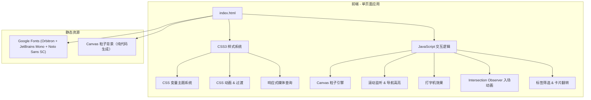

## 1. 架构设计



## 2. 技术说明

- **前端**: 纯原生 HTML5 + CSS3 + Vanilla JavaScript（ES6+），无任何框架依赖
- **字体加载**: Google Fonts CDN 加载 Orbitron、JetBrains Mono、Noto Sans SC
- **粒子背景**: 原生 Canvas API 实现粒子连线网络
- **动画**: CSS3 @keyframes + transition + Intersection Observer API
- **数据存储**: 无需后端，所有内容硬编码在 HTML 中（静态个人博客）
- **部署**: 纯静态文件，可直接用任何 HTTP 服务器或 GitHub Pages 部署

## 3. 路由定义

| 路由 | 用途 |
|------|------|
| /index.html | 单页面个人博客，包含所有区块 |

## 4. 文件结构

```
my-info/
├── index.html          # 主页面（内联 CSS + JS）
├── .trae/
│   └── documents/
│       ├── PRD.md
│       └── TECHNICAL_ARCHITECTURE.md
```

## 5. 核心模块说明

### 5.1 CSS 变量主题系统

```css
:root {
  --bg-primary: #0a0a0f;
  --bg-secondary: #0d1117;
  --color-cyan: #00f0ff;
  --color-purple: #b400ff;
  --color-green: #00ff41;
  --color-white: #e0e0e0;
  --color-gray: #8892b0;
  --font-display: 'Orbitron', sans-serif;
  --font-mono: 'JetBrains Mono', monospace;
  --font-body: 'Noto Sans SC', sans-serif;
}
```

### 5.2 Canvas 粒子系统

- 使用 requestAnimationFrame 驱动 60fps 渲染
- 粒子数量自适应屏幕尺寸
- 粒子间连线基于距离阈值
- 鼠标交互：粒子在鼠标附近产生排斥/吸引效果

### 5.3 滚动交互系统

- Intersection Observer 监听各区块进入视口
- 触发 CSS 类切换实现入场动画
- Scroll 事件监听更新导航栏高亮状态
- 平滑滚动到锚点（scroll-behavior: smooth）

## 6. 性能优化

- 粒子系统使用节流优化鼠标事件
- 使用 will-change 提示浏览器优化动画元素
- 图片使用懒加载（Intersection Observer）
- CSS 动画优先于 JS 动画
- 移动端降低粒子数量
